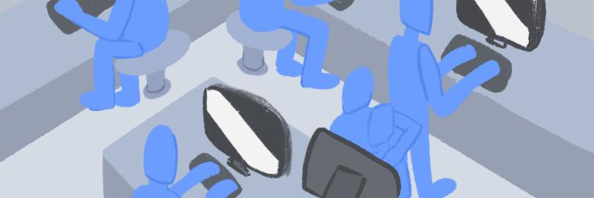
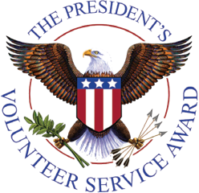

# What is the Inspire Coding Club?

Inspire Coding Club (ICC) is a 503(c) non-profit organization run by students, for students. The Inspire Coding Club is a [Presidential Volunteer Service Award](https://www.presidentialserviceawards.gov/) Certifying Organization.

### How to Join

Join our [Discord Server](https://inspirecoding.org/join) and verify to join! Form teams for competitions and hackathons or teach courses!

# Ways to contribute!

#### Become a Teacher

ICC teachers lead the online classes now and in the future, will give courses at our various branches. Teachers will also actively participate in writing class materials. Teachers can create courses out of any STEAM topic and get them approved or work with other teachers to further the material of existing classes.

#### Become a Teacher Assistant

Anyone is welcome to help our students in courses, answer students&#39; problems, and help with discussion sessions in breakout rooms. No experience with the subject is generally needed unless specifically stated, and long/short term opportunities exist. This is one of the best ways to get volunteer hours, get to know lecturers, and possibly learn some lecture material along the way.

#### Become a Shelter Volunteer

The Inspire Coding Club is proud to proclaim that we have partnered with at-risk and homeless shelters to provide our material to those who may be deprived of such an opportunity otherwise. No coding experience is needed, and managing students/troubleshooting with them is the largest part of the opportunity.

#### Apply as a Branch Director

If you are passionate about coordinating/teaching academic subjects to students at your school (or former schools), you are welcome (and encouraged) to apply to be an ICC branch director for your school (or your community). Message us on [Discord](https://inspirecoding.org/join) for more details.

#### Just Hang Out!

Cultivate a passion to code and talk to others interested in the same subject! Our ultimate goal is to instill a sense of enthusiasm among students for coding, and empower them to have one if they lack the means to do so already. For this reason, joining our [Discord server](https://inspirecoding.org/join) and discussing STEAM topics with fellow members is highly encouraged.

# PVSA Awards

ICC is open to all student volunteers, come to ICC and volunteer now. Your service hours can be accumulated for winning a [Presidential Volunteer Service Award](https://www.presidentialserviceawards.gov/). To apply for a specific role, email <a href="mailto:irvinecodingclub@gmail.com">irvinecodingclub@gmail.com</a> or message us on Discord.

#### Hours Required to Earn Presidential Volunteer Service Awards By Age Group

<link rel="stylesheet" href="assets/css/table.css">
<table class="styled-table">
  <thead>
    <tr>
      <th>Age Group</th>
      <th>Bronze</th>
      <th>Silver</th>
      <th>Gold</th>
      <th>Lifetime Achievement</th>
    </tr>
  </thead>
  <tbody>
    <tr>
      <td>Kids (5–10 years old)</td>
      <td>26–49 hours</td>
      <td>50–74 hours</td>
      <td>75+ hours</td>
      <td>4,000+ hours</td>
    </tr>
    <tr class="active-row">
      <td>Teens (11–15)</td>
      <td>50–74 hours</td>
      <td>75–99 hours</td>
      <td>100+ hours</td>
      <td>4,000+ hours</td>
    </tr>
    <tr>
      <td>Young Adults (16–25)</td>
      <td>100–174 hours</td>
      <td> 175–249 hours </td>
      <td>250+ hours</td>
      <td>4,000+ hours</td>
    </tr>
  </tbody>
</table>
